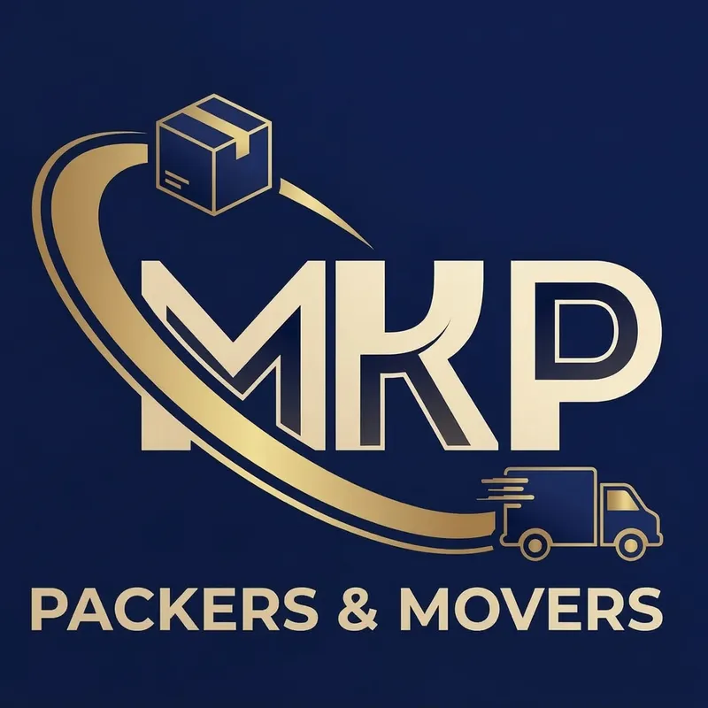

# MKP Packers & Movers - Website


This is the professional corporate and residential relocation services website for **MKP Packers & Movers**. Built with modern web technologies, it provides users with an intuitive interface to get relocation estimates, manage their profiles, and track their moves seamlessly.

## Key Features

- **Lead Generation & Management**: Interactive forms to capture shifting requirements (Local and Intercity).
- **User Authentication & Dashboard**: Secure Google authentication via Supabase. Users can view and track their leads/orders directly from their dashboard.
- **Advanced Location Search**: Custom location autocomplete powered by Nominatim Database.
- **Enhanced Security & Anti-Bot Measures**: Implemented Honeypot fields, rate-limiting, and client-side cooldowns to ensure high-quality lead capture and protect against spam.
- **Modern & Dynamic UI**: Responsive design with Framer Motion animations, a dynamic navbar, and interactive components.
- **SEO & Performance Optimized**: Full Next.js server-side rendering support, properly configured sitemaps, and strict adherence to technical SEO guidelines.

## Tech Stack

- **Framework**: [Next.js 16](https://nextjs.org/) (App Router)
- **Language**: [TypeScript](https://www.typescriptlang.org/)
- **Styling**: [Tailwind CSS v4](https://tailwindcss.com/) & [Framer Motion](https://www.framer.com/motion/)
- **Backend & Database**: [Supabase](https://supabase.com/) (Auth, PostgreSQL Database, Edge Functions)
- **Icons & Components**: [Lucide React](https://lucide.dev/), Material Icons, Sonner (for toast notifications)
- **Analytics & Deployment**: [Vercel](https://vercel.com/) & Vercel Analytics

## Media Upload Guidelines

To maintain performance and SEO, all media added to this project MUST follow these rules:

1. **Optimize Images (The 100KB Rule)**
   - Never upload raw images. Aim for under 100KB.
   - **Convert to WebP**: Always use WebP format.
   - **Resize to Display Size**: Do not upload images larger than their maximum display container (e.g., 800px or 1200px max width).
   - **Use aspect-ratio**: Define `width` and `height` explicitly to prevent Cumulative Layout Shift (CLS). Include `loading="lazy"` for non-critical images.
     ```html
     
     ```

2. **Handle Small Videos (The "Muted" Secret)**
   - **Strip Audio**: Use tools like Handbrake to remove empty audio tracks.
   - **Muted Requirement**: Use the `muted` attribute so modern browsers can autoplay without blocking.
   - **Attributes**: Include `autoplay muted loop playsinline poster="fallback.jpg" preload="none"`.

3. **SEO Checklist for Media**
   - **Descriptive Filenames**: Use descriptive, hyphenated filenames (e.g., `mkp-packers-movers-logo.webp` instead of `IMG_123.jpg`).
   - **Alt Text**: Always include clear, descriptive `alt` text for screen readers and search Engine bots.
   - **Video Schema**: Use schema.org markup if a video is central to a page.

4. **Performance Validation**
   - Test images with [Squoosh.app](https://squoosh.app/) and validate pages with [Google PageSpeed Insights](https://pagespeed.web.dev/).

## Getting Started

### Prerequisites

Ensure you have Node.js (v18+) installed.

### Installation

1. Clone the repository:
   ```bash
   git clone <repository_url>
   cd mkp-website
   ```

2. Install dependencies:
   ```bash
   npm install
   # or
   yarn install
   # or
   pnpm install
   ```

3. Configure Environment Variables:
   Create a `.env.local` file in the root directory and add the necessary Supabase and Vercel keys.
   ```env
   NEXT_PUBLIC_SUPABASE_URL=your_supabase_url
   NEXT_PUBLIC_SUPABASE_ANON_KEY=your_supabase_anon_key
   NEXT_PUBLIC_SITE_URL=http://localhost:3000
   ```

4. Run the development server:
   ```bash
   npm run dev
   # or
   yarn dev
   # or
   pnpm dev
   ```

Open [http://localhost:3000](http://localhost:3000) with your browser to see the result.

## Project Structure

- `src/app/`: Next.js App Router pages and layouts.
- `src/components/`: Reusable React components (Navbar, Footer, AuthModal, LocationAutocomplete, etc.).
- `src/lib/`: Utility functions and static configurations (including Supabase client config).
- `src/services/`: Services handling business logic (e.g., `leadService.ts` for database interactions).
- `public/`: Static files such as images and icons.

## Contact

For any queries regarding the website or its deployment, please refer to the `contact-us` page on the website or reach out to the project maintainer.
